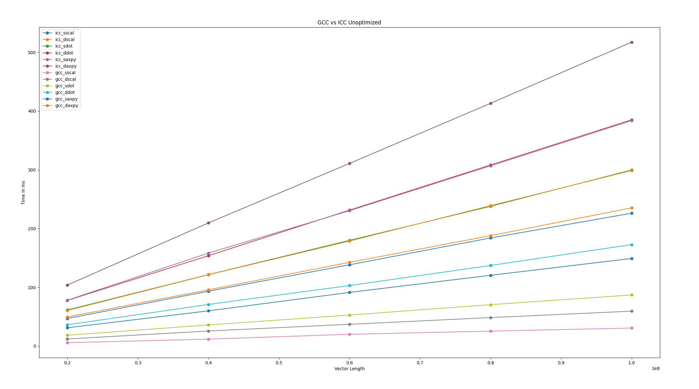
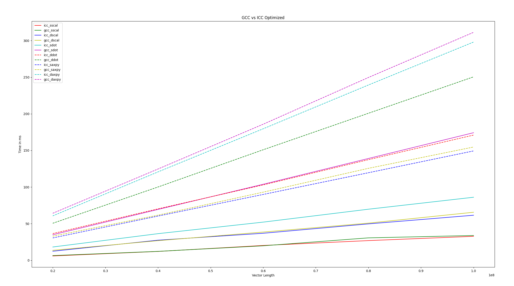
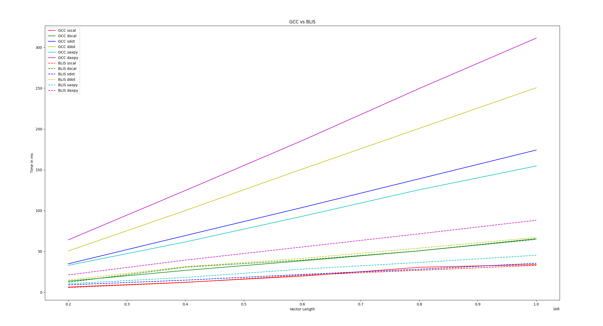
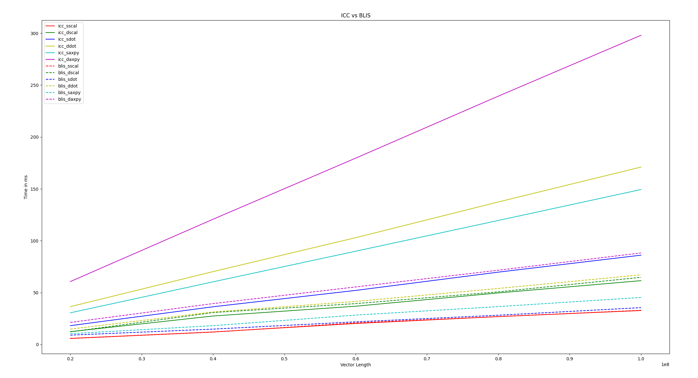

## Software Programming for Performance Assignment

## Prerak Srivastava

## 2020111013

### 1. 

Command used in manjaro `cat /proc/cpuinfo`

Link: https://ark.intel.com/content/www/us/en/ark/products/191075/intel-core-i59300h-processor-8m-cache-up-to-4-10-ghz.html

- Model: Intel(R) Core(TM) i5-9300H CPU 
- Generation: 9
- Frequency Range: 2.40GHz - 4.10GHz
- Number of Cores: 4
- Hyper Threading Availability: Yes
- SIMD ISA: Intel® AVX2
- Cache Size: 8192 KB
- Maximum Main Memory Bandwidth: 41.8 GB/s

### 2.

To theoretically calculate peak FLOPS per core, the formula is as follows:

#### Per Core
```
FLOPS = cycles_per_second * flops_per_cycle
cycles_per_second = 4.10 GHz = 4.10 * 10^9 
flops_per_cycle = 32 (For coffee lake microarchitecture)
FLOPS = 131.2 * 10^9 
FLOPS = FLOPS / 10^9
FLOPS = 131.2 Gflops
```
#### Per Processor
```
no_of_cores = 4
FLOPS_per_processor = 131.2 * 4 = 524.8 Gflops
```

Using whetstone benchmark program

Command 
```
./whetstone 1000000
```
Output
```
Loops: 1000000, Iterations: 1, Duration: 15 sec.
C Converted Double Precision Whetstones: 6666.7 MIPS
```

**Tentatively remove second one hehe uwu**

Command
```
./whetstone 10000000
```
Output
```
Loops: 10000000, Iterations: 1, Duration: 103 sec.
C Converted Double Precision Whetstones: 9708.7 MIPS
```

Running another benchmark gives the following results
```
cd Flops/version3
bash compile_linux_gcc.sh
./2013-Haswell
```
The output is stored in `flops_benchmark_output.txt`

#### Writing Benchmark to calculate FLOPS

To measure FLOPS we first need code that performs floating point operations, and measure its execution time 

```c
void func1(){
    // perform floating point instructions
    double x = 1.5;
    double y = 2.5;
    // total number of floating point instructions performed = 200000000
    for (int i = 0; i < 100000000; i++) {
        x = x + y;
        y = x * y;
    }
}
```
Command
```
cd benchmark
gcc benchmark.c -O1
./a.out 
```
Output
```
----------------------------------------
func1
time: 0.509031 s
----------------------------------------
FLOPS: 3.929034 GFLOPS
```

As we can see, this benchmark is heavily unoptimized for the following reasons
- there is kind of parralelism being used
- This can be made efficient by using parallelization using OpenMP or vectorization.

### 3.
<!-- 
Reference for maximum memory bandwidth: https://codearcana.com/posts/2013/05/18/achieving-maximum-memory-bandwidth.html -->

- Main memory size: 15.5 GB
- Memory type: DDR4

#### Stream Benchmark

Benchmarking using STREAM submodule

**Compler**: icc

Command used
```
cd stream-benchmark/STREAM
make stream.icc
./stream.omp.AVX2.80M.20x.icc
```
Output
```
-------------------------------------------------------------
STREAM version $Revision: 5.10 $
-------------------------------------------------------------
This system uses 8 bytes per array element.
-------------------------------------------------------------
Array size = 80000000 (elements), Offset = 0 (elements)
Memory per array = 610.4 MiB (= 0.6 GiB).
Total memory required = 1831.1 MiB (= 1.8 GiB).
Each kernel will be executed 20 times.
 The *best* time for each kernel (excluding the first iteration)
 will be used to compute the reported bandwidth.
-------------------------------------------------------------
Number of Threads requested = 8
Number of Threads counted = 8
-------------------------------------------------------------
Your clock granularity/precision appears to be 1 microseconds.
Each test below will take on the order of 56318 microseconds.
   (= 56318 clock ticks)
Increase the size of the arrays if this shows that
you are not getting at least 20 clock ticks per test.
-------------------------------------------------------------
WARNING -- The above is only a rough guideline.
For best results, please be sure you know the
precision of your system timer.
-------------------------------------------------------------
Function    Best Rate MB/s  Avg time     Min time     Max time
Copy:           28061.6     0.045808     0.045614     0.046849
Scale:          28122.0     0.045844     0.045516     0.049271
Add:            31367.5     0.061685     0.061210     0.062947
Triad:          31334.8     0.061489     0.061274     0.062979
-------------------------------------------------------------
Solution Validates: avg error less than 1.000000e-13 on all three arrays
-------------------------------------------------------------
```
**Compiler**: gcc 

Command used
```
cd stream-benchmark/STREAM
make stream_c.exe
./stream_c.exe
```

Output
```
-------------------------------------------------------------
STREAM version $Revision: 5.10 $
-------------------------------------------------------------
This system uses 8 bytes per array element.
-------------------------------------------------------------
Array size = 10000000 (elements), Offset = 0 (elements)
Memory per array = 76.3 MiB (= 0.1 GiB).
Total memory required = 228.9 MiB (= 0.2 GiB).
Each kernel will be executed 10 times.
 The *best* time for each kernel (excluding the first iteration)
 will be used to compute the reported bandwidth.
-------------------------------------------------------------
Number of Threads requested = 8
Number of Threads counted = 8
-------------------------------------------------------------
Your clock granularity/precision appears to be 1 microseconds.
Each test below will take on the order of 7344 microseconds.
   (= 7344 clock ticks)
Increase the size of the arrays if this shows that
you are not getting at least 20 clock ticks per test.
-------------------------------------------------------------
WARNING -- The above is only a rough guideline.
For best results, please be sure you know the
precision of your system timer.
-------------------------------------------------------------
Function    Best Rate MB/s  Avg time     Min time     Max time
Copy:           25576.0     0.006524     0.006256     0.008151
Scale:          18857.2     0.008594     0.008485     0.008924
Add:            21613.6     0.011240     0.011104     0.011505
Triad:          21177.1     0.011542     0.011333     0.012044
-------------------------------------------------------------
Solution Validates: avg error less than 1.000000e-13 on all three arrays
-------------------------------------------------------------
```
Therefore, main memory bandwidth using the stream benchmark is coming around 25-28 GB/s
### 4. 

Secondary Storage Device: HDD

- Size: 1 TB
- Average Read Rate: 222.4 MB/s
- Average Write Rate: 69.8 MB/s
- Average Access Time: 4.04 ms

# Know your Cluster

- ADA Peak FLOPs: 70.66 TFLOPS
- Abacus Peak FLOPs: 14 TFLOPS

## BLAS Problems

### BLAS Level 1

#### BLAS
Command
```shell
cd blas-problems/q1
make
./q1 1
./q1 2
./q1 3
./q1 4
./q1 
```
First method for writing LEVEL 1 functions is written in blas-problems/q1/q1.c

Output (The time given here is in ms)

#### Approach 1: Without Optimizations

#### **Compiler**: icc

**Flags**: `-g -axCORE-AVX2`

**Execution Time**:

| Vector Length |   sSCAL   |   dSCAL   |   sDOT    |    dDOT    |   sAXPY    |   dAXPY    |
| :-----------: | :-------: | :-------: | :-------: | :--------: | :--------: | :--------: |
|   20000000    | 5.683000  | 11.999000 | 18.366000 | 36.138000  | 31.115000  | 60.476000  |
|   40000000    | 11.785000 | 25.601000 | 35.906000 | 70.732000  | 59.858000  | 121.335000 |
|   60000000    | 20.011000 | 37.013000 | 52.773000 | 102.953000 | 91.307000  | 178.677000 |
|   80000000    | 25.380000 | 48.444000 | 70.426000 | 137.163000 | 120.422000 | 238.981000 |
|   100000000   | 30.644000 | 59.337000 | 86.987000 | 172.691000 | 149.039000 | 298.794000 |

**GFlops**:

| Vector Length | sSCAL              | dSCAL              | sDOT               | dDOT               | sAXPY              | dAXPY              |
| ------------- | ------------------ | ------------------ | ------------------ | ------------------ | ------------------ | ------------------ |
| 20000000      | 3.5192679922576104 | 1.6668055671305941 | 2.1779374931939453 | 1.1068681166638994 | 1.2855535915153462 | 0.6614194060453734 |
| 40000000      | 3.3941450997030125 | 1.5624389672278427 | 2.2280398819138862 | 1.1310298026352994 | 1.3364963747535834 | 0.6593316025878765 |
| 60000000      | 2.998350907001149  | 1.62105206278875   | 2.273890057415724  | 1.1655804104785679 | 1.314247538523881  | 0.6716029483369432 |
| 80000000      | 3.1520882584712373 | 1.651391297167864  | 2.2718882230994235 | 1.1664953376639473 | 1.3286608759196825 | 0.6695092915336366 |
| 100000000     | 3.1520882584712373 | 1.6852891113470516 | 2.299194132456574  | 1.1581379458107255 | 1.3419306356054455 | 0.6693574837513471 |

**Compiler**: gcc

**Flags**: `-g -lm`

**Execution Time**:

| Vector Length |   sSCAL    |   dSCAL    |    sDOT    |    dDOT    |   sAXPY    |   dAXPY    |
| :-----------: | :--------: | :--------: | :--------: | :--------: | :--------: | :--------: |
|   20000000    | 46.826000  | 49.500000  | 61.455000  | 77.696000  | 78.032000  | 103.776000 |
|   40000000    | 93.332000  | 95.730000  | 121.595000 | 153.765000 | 158.216000 | 209.573000 |
|   60000000    | 138.300000 | 142.435000 | 179.921000 | 231.348000 | 230.364000 | 310.813000 |
|   80000000    | 183.993000 | 187.902000 | 237.832000 | 308.195000 | 306.761000 | 413.144000 |
|   100000000   | 226.088000 | 235.211000 | 299.763000 | 385.151000 | 383.734000 | 517.293000 |

**GFlops**:

| Vector Length | sSCAL               | dSCAL               | sDOT               | dDOT               | sAXPY              | dAXPY               |
| ------------- | ------------------- | ------------------- | ------------------ | ------------------ | ------------------ | ------------------- |
| 20000000      | 0.4271131422713877  | 0.40404040404040403 | 0.6508827597429013 | 0.514827018121911  | 0.5126102111954071 | 0.38544557508479804 |
| 40000000      | 0.428577551107873   | 0.41784184686096315 | 0.6579217895472675 | 0.5202744447696159 | 0.5056378621631188 | 0.38172856236251806 |
| 60000000      | 0.43383947939262474 | 0.4212447783199354  | 0.666959387731282  | 0.5186991026505524 | 0.5209147262593113 | 0.3860842371458079  |
| 80000000      | 0.43479914996766184 | 0.42575385041138464 | 0.6727437855292812 | 0.519151835688444  | 0.5215786882947963 | 0.38727417074918186 |
| 100000000     | 0.44230565089699586 | 0.42515018430260487 | 0.6671937497289525 | 0.5192768550516551 | 0.5211943690160371 | 0.3866280811841645  |

#### GCC VS ICC



#### Approach 2: With Optimizations (flags)

#### **Compiler**: icc

**Flags**: `-g -O3 -axCORE-AVX2`

**Execution Time**: 

| Vector Length |   sSCAL   |   dSCAL   |   sDOT    |    dDOT    |   sAXPY    |   dAXPY    |
| :-----------: | :-------: | :-------: | :-------: | :--------: | :--------: | :--------: |
|   20000000    | 5.869000  | 12.336000 | 18.123000 | 36.464000  | 30.512000  | 60.612000  |
|   40000000    | 12.054000 | 27.428000 | 36.330000 | 70.216000  | 60.362000  | 120.673000 |
|   60000000    | 20.224000 | 36.869000 | 52.101000 | 102.929000 | 89.885000  | 179.584000 |
|   80000000    | 26.866000 | 49.693000 | 69.725000 | 137.384000 | 119.536000 | 239.356000 |
|   100000000   | 32.710000 | 61.508000 | 86.079000 | 171.000000 | 149.342000 | 298.043000 |

**GFlops**:

| Vector Length | sSCAL  | dSCAL  | sDOT   | dDOT   | sAXPY  | dAXPY  |
| ------------- | ------ | ------ | ------ | ------ | ------ | ------ |
| 20000000      | 3.4077 | 3.4077 | 2.2071 | 1.097  | 1.311  | 0.6599 |
| 40000000      | 3.3184 | 3.3184 | 2.202  | 1.1393 | 1.3253 | 0.6629 |
| 60000000      | 2.9667 | 2.9668 | 2.3032 | 1.1659 | 1.335  | 0.6682 |
| 80000000      | 2.9777 | 2.9777 | 2.2947 | 1.1646 | 1.3385 | 0.6685 |
| 100000000     | 3.057  | 3.0572 | 2.3234 | 1.1696 | 1.3392 | 0.671  |

#### **Compiler**: gcc

**Flags**: `-g -O3 -lm`

**Execution Time**:

| Vector Length | sSCAL     | dSCAL     | sDOT       | dDOT       | sAXPY      | dAXPY      |
| ------------- | --------- | --------- | ---------- | ---------- | ---------- | ---------- |
| 20000000      | 6.377000  | 13.561000 | 34.853000  | 50.526000  | 32.928000  | 64.173000  |
| 40000000      | 12.148000 | 26.763000 | 69.398000  | 100.064000 | 61.586000  | 124.626000 |
| 60000000      | 19.758000 | 38.489000 | 103.804000 | 150.921000 | 93.030000  | 185.809000 |
| 80000000      | 30.590000 | 50.709000 | 138.987000 | 200.757000 | 125.574000 | 249.614000 |
| 100000000     | 33.822000 | 65.588000 | 174.219000 | 250.510000 | 154.668000 | 311.347000 |

**GFlops**:

| Vector Length | sSCAL  | dSCAL  | sDOT   | dDOT   | sAXPY  | dAXPY  |
| ------------- | ------ | ------ | ------ | ------ | ------ | ------ |
| 20000000      | 3.1363 | 1.4748 | 1.1477 | 0.7917 | 1.2148 | 0.6233 |
| 40000000      | 3.2927 | 1.4946 | 1.1528 | 0.7995 | 1.299  | 0.6419 |
| 60000000      | 3.0367 | 1.5589 | 1.156  | 0.7951 | 1.2899 | 0.6458 |
| 80000000      | 2.6152 | 1.5776 | 1.1512 | 0.797  | 1.2741 | 0.641  |
| 100000000     | 2.9567 | 1.5247 | 1.148  | 0.7984 | 1.2931 | 0.6424 |

#### GCC VS ICC

#### BLIS

BLIS has been install at the location `~/blis` on my system, for which I have updated the makefiles accordingly to link all the required files. 

Command
```shell
cd blas-problems/blis/q1
make
./q1.x 1
./q1.x 2
./q1.x 3
./q1.x 4
./q1.x
```
Output

**Execution Time**:

| Vector Length | sSCAL     | dSCAL     | sDOT      | dDOT      | sAXPY     | dAXPY     |
| ------------- | --------- | --------- | --------- | --------- | --------- | --------- |
| 20000000      | 5.714000  | 12.136000 | 9.010000  | 14.820000 | 10.373000 | 21.235000 |
| 40000000      | 11.926000 | 30.753000 | 14.807000 | 31.321000 | 18.133000 | 39.392000 |
| 60000000      | 20.825000 | 39.367000 | 21.812000 | 41.456000 | 28.326000 | 55.455000 |
| 80000000      | 26.899000 | 50.724000 | 28.183000 | 54.002000 | 36.504000 | 71.568000 |
| 100000000     | 32.963000 | 64.747000 | 35.517000 | 67.153000 | 45.323000 | 88.239000 |

**GFlops**:

| Vector Length | sSCAL  | dSCAL  | sDOT   | dDOT   | sAXPY  | dAXPY  |
| ------------- | ------ | ------ | ------ | ------ | ------ | ------ |
| 20000000      | 3.5002 | 1.648  | 4.4395 | 2.6991 | 3.8562 | 1.8837 |
| 40000000      | 3.354  | 1.3007 | 5.4029 | 2.5542 | 4.4118 | 2.0309 |
| 60000000      | 2.8812 | 1.5241 | 5.5016 | 2.8946 | 4.2364 | 2.1639 |
| 80000000      | 2.9741 | 1.5772 | 5.6772 | 2.9629 | 4.3831 | 2.2356 |
| 100000000     | 3.0337 | 1.5445 | 5.6311 | 2.9783 | 4.4128 | 2.2666 |

#### GCC VS BLIS



#### ICC VS BLIS



#### Operational Intensity

$$
OI = \frac{\text{number of operations}}{\text{number of bytes}}
$$

1. sSCAL

   The number of bytes that are involved in the operation will be 4 multiplied by the length of the vector because data type is float. For scaling, one operation is applied per number in the vector, making the total number of operations equal to N
   $$
    
   \therefore \ OI = \frac{N}{N*4} = 0.25
   $$

2. dSCAL 

   The number of bytes that are involved in the operation will be 4 multiplied by the length of the vector because data type is double. For scaling, one operation is applied per number in the vector, making the total number of operations equal to N
   $$
   \therefore \ OI = \frac{N}{N*8} = 0.125
   $$

3. sDOT

   The number of operations in dot product will be 2\*N as each corresponding number in the vector will be multiplied and then this product is being added to a variable. The total number of bytes that are involved will be 2\*N\*4 as 2 vectors are need for dot product and each number is of size 4 bytes(float).
   $$
   OI = \frac{2*N}{2*N*4} = 0.25
   $$
   
4. dDOT

   The number of operations in dot product will be 2\*N as each corresponding number in the vector will be multiplied and then this product is being added to a variable. The total number of bytes that are involved will be 2\*N\*8 as 2 vectors are need for dot product and each number is of size 8 bytes(double).
   $$
   OI = \frac{2*N}{2*N*8} = 0.125
   $$

5. sAXPY

   The number of operations in dot product will be 2\*N as each corresponding number in the vector will be multiplied and then this product is being added to a variable. The total number of bytes that are involved will be 2\*N\*4 as 2 vectors are need for dot product and each number is of size 4 bytes(float).
   $$
   OI = \frac{2*N}{2*N*4} = 0.25
   $$
   
6. dAXPY

   The number of operations in dot product will be 2\*N as each corresponding number in the vector will be multiplied and then this product is being added to a variable. The total number of bytes that are involved will be 2\*N\*8 as 2 vectors are need for dot product and each number is of size 8 bytes(double).
   $$
   OI = \frac{2*N}{2*N*8} = 0.125
   $$

#### Baseline and Best Execution Times (in ms)

| Function | Baseline Execution Time | Best Execution Time |
| -------- | ----------------------- | ------------------- |
| sSCAL    | 226.088000              | 30.644000           |
| dSCAL    | 235.211000              | 59.337000           |
| sDOT     | 299.763000              | 86.079000           |
| dDOT     | 385.151000              | 171.000000          |
| sAXPY    | 383.734000              | 149.039000          |
| dAXPY    | 517.293000              | 298.043000          |

#### Speedup

Using the data for vector length = 100000000
$$
\text{Speedup} = \frac{\text{Baseline Execution Time}}{\text{Best Execution Time}}
$$

1. sSCAL
   $$
   \text{Speedup} = \frac{226.088}{30.644} = 7.37888
   $$

2. dSCAL
   $$
   \text{Speedup} = \frac{235.211}{59.337} = 3.9639
   $$

3. sDOT 
   $$
   \text{Speedup} = \frac{299.763}{86.079} = 3.48241
   $$

4. dDOT
   $$
   \text{Speedup} = \frac{385.151}{171} = 2.252345
   $$

5. sAXPY
   $$
   \text{Speedup} = \frac{383.734}{149.039} = 2.574722
   $$

6. dAXPY
   $$
   \text{Speedup} = \frac{517.293}{298.043} = 1.735632
   $$
   

#### Baseline and Optimized GFlops

 Using the data for vector length = 100000000
$$
\text{GFlops} = \frac{\text{Number of floating point operations}}{\text{Execution Time (in ms)}*10^6}
$$

For sSCAL and dSCAL, 
$$
\text{GFlops} = \frac{N}{Time}
$$
and for the rest of the functions
$$
\text{GFlops} = \frac{2*N}{Time}
$$


|                  | sSCAL  | dSCAL  | sDOT    | dDOT    | sAXPY   | dAXPY   |
| ---------------- | ------ | ------ | ------- | ------- | ------- | ------- |
| Baseline GFlops  | 0.4423 | 0.4251 | 0.66719 | 0.51927 | 0.52119 | 0.38662 |
| Optimized GFlops | 3.152  | 3.0572 | 5.6311  | 2.9783  | 4.4128  | 2.2666  |

**Is the problem memory bound or compute bound?**

#### Memory BandWidth

$$
\text{Memory Bandwidth} = \frac{\text{Number of bytes accessed}}{\text{time}}
$$

For sSCAL, 
$$
\text{Memory Bandwidth} = \frac{N*4}{\text{Time}}
$$
For dSCAL,
$$
\text{Memory Bandwidth} = \frac{N*8}{\text{Time}}
$$
For sDOT,
$$
\text{Memory Bandwidth} = \frac{N*4*2}{\text{Time}}
$$
For dDOT,
$$
\text{Memory Bandwidth} = \frac{N*8*2}{\text{Time}}
$$
For sAXPY,
$$
\text{Memory Bandwidth} = \frac{N*4*2}{\text{Time}}
$$
For dAXPY,
$$
\text{Memory Bandwidth} = \frac{N*8*2}{\text{Time}}
$$
Using the data for vector length = 100000000, for the BLIS implementation, since it is the most optimized

| Function | Memory Bandwidth (in GB/s) |
| :------: | :------------------------: |
|  sSCAL   |          12.1348           |
|  dSCAL   |          12.3557           |
|   sDOT   |          22.5244           |
|   dDOT   |          23.8261           |
|  sAXPY   |           17.651           |
|  dAXPY   |          18.1325           |

### BLAS Level 2

Assuming the vector to be a column vector, which makes it easier to write the function, as we can directly multiply the matrix with the vector without having to calculate the transpose of the matrix.

#### BLAS

Command

```
cd blas-problems/q2
make
./q2 1
./q2 2
./q2 3
./q2 4
./q2 5
```

#### Approach 1: Without Optimizations

#### **Compiler**: icc

**Flags**: `-g -axCORE-AVX2`

**Execution Time**: 

| Rows  | Columns | sGEMV     | dGEMV     |
| ----- | ------- | --------- | --------- |
| 2000  | 4000    | 1.045000  | 2.003000  |
| 4000  | 6000    | 3.712000  | 6.952000  |
| 6000  | 8000    | 8.011000  | 15.216000 |
| 8000  | 10000   | 13.690000 | 26.755000 |
| 10000 | 12000   | 21.215000 | 41.746000 |

**GFlops**:

| Rows  | Columns | sGEMV   | dGEMV   |
| ----- | ------- | ------- | ------- |
| 2000  | 4000    | 22.9722 | 11.985  |
| 4000  | 6000    | 19.3998 | 10.3585 |
| 6000  | 8000    | 17.9775 | 9.4649  |
| 8000  | 10000   | 17.5328 | 8.9712  |
| 10000 | 12000   | 16.9705 | 8.6243  |

#### **Compiler**: gcc

**Flags**: `-g -lm`

**Execution Time**:

**Very Skeptical of the data for gcc**

| Rows  | Columns | sGEMV      | dGEMV      |
| ----- | ------- | ---------- | ---------- |
| 2000  | 4000    | 24.295000  | 25.143000  |
| 4000  | 6000    | 74.686000  | 75.594000  |
| 6000  | 8000    | 149.277000 | 155.780000 |
| 8000  | 10000   | 249.542000 | 257.111000 |
| 10000 | 12000   | 369.120000 | 381.355000 |

**GFlops**:

| Rows  | Columns | sGEMV  | dGEMV  |
| ----- | ------- | ------ | ------ |
| 2000  | 4000    | 0.9879 | 0.9546 |
| 4000  | 6000    | 0.9641 | 0.9525 |
| 6000  | 8000    | 0.9647 | 0.9244 |
| 8000  | 10000   | 0.9618 | 0.9335 |
| 10000 | 12000   | 0.9753 | 0.944  |

​	

#### Approach 2: Vectorization using -O3

#### **Compiler**: icc

**Flags**: `-g -axCORE-AVX2 -O3`

**Execution Time**:

| Rows  | Columns | sGEMV     | dGEMV     |
| ----- | ------- | --------- | --------- |
| 2000  | 4000    | 1.104000  | 1.823000  |
| 4000  | 6000    | 3.272000  | 6.651000  |
| 6000  | 8000    | 7.040000  | 14.259000 |
| 8000  | 10000   | 12.097000 | 24.133000 |
| 10000 | 12000   | 18.616000 | 36.436000 |

**GFlops**: 

| Rows  | Columns | sGEMV   | dGEMV   |
| ----- | ------- | ------- | ------- |
| 2000  | 4000    | 21.7409 | 13.1662 |
| 4000  | 6000    | 22.0061 | 10.826  |
| 6000  | 8000    | 20.4554 | 10.0993 |
| 8000  | 10000   | 19.8403 | 9.9452  |
| 10000 | 12000   | 19.3387 | 9.8806  |

#### **Compiler**: gcc

**Flags**: `-g -O3 -lm`

**Execution Time**:

| Rows  | Columns | sGEMV      | dGEMV      |
| ----- | ------- | ---------- | ---------- |
| 2000  | 4000    | 8.149000   | 8.225000   |
| 4000  | 6000    | 24.035000  | 25.281000  |
| 6000  | 8000    | 48.436000  | 51.744000  |
| 8000  | 10000   | 82.096000  | 86.864000  |
| 10000 | 12000   | 124.460000 | 130.238000 |

**GFlops**: 

| Rows  | Columns | sGEMV  | dGEMV  |
| ----- | ------- | ------ | ------ |
| 2000  | 4000    | 2.9454 | 2.9182 |
| 4000  | 6000    | 2.9958 | 2.8481 |
| 6000  | 8000    | 2.9731 | 2.783  |
| 8000  | 10000   | 2.9235 | 2.763  |
| 10000 | 12000   | 2.8926 | 2.7642 |


#### Approach 3: Parallelization using OpenMP

To facilitate parallelization, a temp variable was defined separately so that `Y` is not accessed in the inner for loop, which removes the loop dependencies and allows for parallelization.

```c
#pragma omp parallel for
for(int i = 0; i < M; i++)
{
 	double temp = 0.0;
    Y[i*incY] = beta * Y[i*incY];
    for(int j = 0; j < N; j++)
    {
        temp += alpha * A[i*lda+j] * X[j*incX];
    }
    Y[i*incY] += temp;
}
```

#### Compiler : icc

**Flags**: `-g -axCORE-AVX2 -O3 -qopenmp`

**Execution Time**: 

| Rows  | Columns | sGEMV     | dGEMV     |
| ----- | ------- | --------- | --------- |
| 2000  | 4000    | 1.872000  | 2.402000  |
| 4000  | 6000    | 3.450000  | 5.746000  |
| 6000  | 8000    | 6.038000  | 11.031000 |
| 8000  | 10000   | 10.227000 | 19.049000 |
| 10000 | 12000   | 14.853000 | 27.858000 |

**GFlops:** 

| Rows  | Columns | sGEMV   | dGEMV   |
| ----- | ------- | ------- | ------- |
| 2000  | 4000    | 12.8216 | 9.9925  |
| 4000  | 6000    | 20.8707 | 12.5312 |
| 6000  | 8000    | 23.85   | 13.0547 |
| 8000  | 10000   | 23.4681 | 12.5995 |
| 10000 | 12000   | 24.2382 | 12.923  |

#### Compiler: gcc

**Flags**: `-g -O3 -lm -fopenmp`

**Execution Time**: 

| Rows  | Columns | sGEMV     | dGEMV     |
| ----- | ------- | --------- | --------- |
| 2000  | 4000    | 1.208000  | 1.530000  |
| 4000  | 6000    | 3.467000  | 4.771000  |
| 6000  | 8000    | 6.805000  | 10.778000 |
| 8000  | 10000   | 11.866000 | 17.777000 |
| 10000 | 12000   | 17.092000 | 27.520000 |

**GFlops:** 

| Rows  | Columns | sGEMV   | dGEMV   |
| ----- | ------- | ------- | ------- |
| 2000  | 4000    | 19.8692 | 15.6876 |
| 4000  | 6000    | 20.7684 | 15.092  |
| 6000  | 8000    | 21.1618 | 13.3611 |
| 8000  | 10000   | 20.2265 | 13.501  |
| 10000 | 12000   | 21.0631 | 13.0818 |


#### BLIS

Command

```
cd blas-problems/blis/q2
make
./q1.x 1
./q1.x 2
./q1.x 3
./q1.x 4
./q1.x 5
```

**Execution Time**:

| Rows  | Columns | sGEMV     | dGEMV     |
| ----- | ------- | --------- | --------- |
| 2000  | 4000    | 1.384000  | 2.449000  |
| 4000  | 6000    | 4.267000  | 7.365000  |
| 6000  | 8000    | 7.819000  | 14.861000 |
| 8000  | 10000   | 12.805000 | 27.344000 |
| 10000 | 12000   | 19.069000 | 37.570000 |

**GFlops**:

| Rows  | Columns | sGEMV   | dGEMV  |
| ----- | ------- | ------- | ------ |
| 2000  | 4000    | 17.3425 | 9.8007 |
| 4000  | 6000    | 16.8746 | 9.7765 |
| 6000  | 8000    | 18.4174 | 9.6902 |
| 8000  | 10000   | 18.7433 | 8.7774 |
| 10000 | 12000   | 18.8793 | 9.5824 |

#### sGEMV Performance Graph

Both baseline and vectorized gcc versions performed poorly as compared to the rest, because of which the other lines in the graph were become indiscernible, so for this reason those werent plotted.


#### dGEMV Performance

Baseline gcc version performed poorly as compared to the rest, because of which the other lines in the graph were become indiscernible, so for this reason it wasnt plotted.


#### Baseline and Best Execution Times (in ms)

Using the data for matrix dimensions 10000*12000	

| Function | Baseline Execution Time | Best Execution Time |
| -------- | ----------------------- | ------------------- |
| sGEMV    | 369.120000              | 14.853000           |
| dGEMV    | 381.355000              | 27.520000           |

#### Speedup

For sGEMV, 
$$
\text{Speedup} = \frac{369.12}{14.853} = 24.8515
$$
For dGEMV, 
$$
\text{Speedup} = \frac{381.355}{27.52} = 13.8573
$$

#### Baseline and Optimized GFlops

For the following function

```c
for(int j = 0; j < M; j++)
{
    Y[j*incY] = beta * Y[j*incY];
    for(int i = 0; i < N; i++)
    {
    	Y[j*incY] += alpha * A[i*lda+j] * X[i*incX];
    }
}
```

For the following function, we can say that the total number of operations would be as follows

- Inside the inside for loop, the line that is being executed contains 3 floating point operations which is being repeated N times.
- The line just above the inner for loop is one floating point instruction
- Both these instructions above are repeated M times, therefore the total number of floating point operations will be $M*(3*N + 1)$


$$
\text{GFlops} = \frac{\text{3*M*N + M}}{\text{Time(in ms)}*10^6}
$$
Using the data for matrix dimensions 10000*12000	

|                  | sGEMV   | dGEMV   |
| ---------------- | ------- | ------- |
| Baseline GFlops  | 0.9753  | 0.944   |
| Optimized GFlops | 24.2382 | 13.0818 |

#### Operational Intensity

$$
OI = \frac{\text{number of operations}}{\text{number of bytes}}
$$

1. sGEMV: The number of operations is equal to $M*(3*N + 1)$. The total number of bytes is calculated as follows. N(Y) is defined as the total number of bytes in Y.
   $$
   \text{Total number of bytes} = N(A) + N(X) + N(Y) \\ = 4*(M*N + M + N) \\ OI = \frac{M*(3N+1)}{4*(MN+M+N)}
   $$

2. dGEMV: The calculation remains the same as sGEMV, but instead each number is represented using 8 bytes.
   $$
   OI = \frac{M*(3N+1)}{8*(MN+M+N)}
   $$

Using the data for matrix dimensions 10000*12000	

#### Memory Bandwidth

$$
\text{Memory Bandwidth} = \frac{\text{Number of bytes accessed}}{\text{time}}
$$

1. sGEMV
   $$
   \text{Memory Bandwidth} = \frac{4(MN + M + N)}{\text{Time}}
   $$

2. dGEMV
   $$
   \text{Memory Bandwidth} = \frac{8(MN + M + N)}{\text{Time}}
   $$

Using the data for matrix dimensions 10000*12000	

| Function | Memory Bandwidth (GB/s) |
| -------- | ----------------------- |
| sGEMV    | 32.322                  |
| dGEMV    | 34.8901                 |

**Is the problem memory bound or compute bound?**

### BLAS Level 3

#### BLAS

#### Approach 1: Without Optimizations

#### Compiler: icc

**Flags**:

**Execution Time**:

**GFlops**:

#### Compiler: gcc

**Flags**:

**Execution Time**:

**GFlops**:

#### Approach 2: Vectorization using -O3

**Flags**:

**Execution Time**:

**GFlops**:

#### Compiler: gcc

**Flags**:

**Execution Time**:

**GFlops**:

#### Approach 3: Parallelization using OpenMP

**Flags**:

**Execution Time**:

**GFlops**:

#### Compiler: gcc

**Flags**:

**Execution Time**:

**GFlops**:


